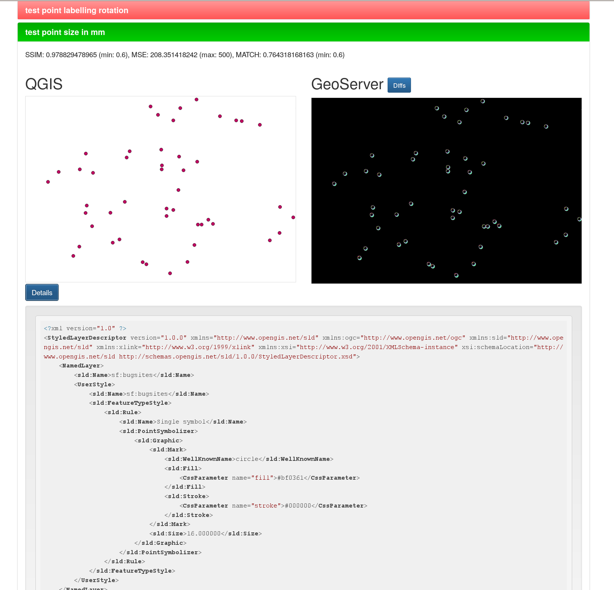

QGIS GeoServer SLD adapter tests
================================

This unit tests QGIS and GeoServer rendering engines by comparing WMS GetImage
output.

Several SLD transformation routines can be tests, currently, the only tested
routine is `sldadapter.py` from GeoServer Explorer QGIS plugin.

The tests are dynamically generated from a QGIS project (see: worflow).

Success criteria
----------------

Images are compared with different algorithms (other comparison functions could be easily added):

* MATCH Compute template match - 1.0 for identical images
* MSE Compute the mean-squared error between two images - 0.0 for identical images
* SSIM Compute the mean structural similarity index between two images - 1.0 for identical images (https://en.wikipedia.org/wiki/Structural_similarity)

For each test, you can define custom thresholds for success by setting custom variables
in QGIS layer options:

* `expected_match` test fails if MATCH is greater
* `expected_ssim` test fails if MSE is greater
* `expected_mse` test fails if SSIM is lesser

Prerequisites
-------------

See `REQUIREMENTS.txt` for the necessary virtualenv Python packages.

A running instance of QGIS Server
A running instance of GeoServer
QGIS Desktop (for tests design)

Configuration
-------------

Default configuration values are stored in the main file header,

Tests can be configured globally by overriding the default configuration values
in `config_local.py` (see: `config.py` for default values) or individually by setting
custom variables in QGIS layer configuration.

Supported variables are:

    * bbox: the bounding box in OGC format
    * width: width of the image in px
    * height: height of the image in px
    * expected_match: threshold for test success
    * expected_mse: threshold for test success
    * expected_ssim: threshold for test success

The snippet here below, can be used inside QGIS to create a new test from the current view,
by cloning the active layer::

    def makeTest(name=None):
        from qgis.utils import iface
        canvas = iface.mapCanvas()
        vl = iface.activeLayer()
        newl = iface.addVectorLayer( vl.source(), (name if name is not None else vl.name()), vl.providerType() )
        if newl.customProperty('variableNames'):
            names = newl.customProperty('variableNames')
            values = newl.customProperty('variableValues')
        else:
            names = []
            values = []
        xform = QgsCoordinateTransform(canvas.mapRenderer().destinationCrs(), QgsCoordinateReferenceSystem('EPSG:4326'))
        extent = xform.transform(canvas.extent())
        bbox = "%s,%s,%s,%s" % (extent.yMinimum(), extent.xMinimum(), extent.yMaximum(), extent.xMaximum())
        names.append('bbox')
        values.append(str(bbox))
        names.append('height')
        values.append(canvas.size().height())
        names.append('width')
        values.append(canvas.size().width())
        newl.setCustomProperty('variableValues', values)
        newl.setCustomProperty('variableNames', names)
        QgsMapLayerRegistry.instance().addMapLayer(newl)

Workflow
--------

#. prepare your test data in GeoServer, expose the layers as WFS
#. open QGIS and load the test layers from GeoServer as WFS
#. rename (or copy) the test layers as "test_yourfancytestname"
#. optionally define the custom success thresholds by creating the corresponding variables in QGIS layer options
#. save QGIS project
#. run the test
#. optionally, browse the results folder (see: `results.html`)

Reports
-------

All intermediate files are stored in the `results` folder:

* QML
* SLD 1.1
* SLD 1.0
* GeoServer GetImage
* QGIS GetImage
* DIFF image (image containing the diffs between the two images)

A `results.html` file containing all tests outcomes is also generated:

